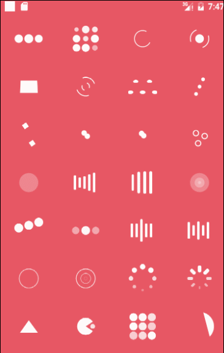

[](https://android-arsenal.com/details/1/2686)

AVLoadingIndicatorView
===================

> **Now AVLoadingIndicatorView was updated version to 2.X , If you have any question or suggestion  with this library , welcome to tell me !**

## Introduction
AVLoadingIndicatorView is a collection of nice loading animations for Android.

You can also find iOS version of this [here](https://github.com/ninjaprox/NVActivityIndicatorView).

## Demo


## Usage

### Step 1

Add dependencies in build.gradle.
```groovy
    dependencies {
       compile 'com.wang.avi:library:2.1.3'
    }
```

### Step 2

Add the AVLoadingIndicatorView to your layout:

Simple 

```java
    <com.wang.avi.AVLoadingIndicatorView
        android:layout_width="wrap_content"  
        android:layout_height="wrap_content"
        app:indicatorName="BallPulseIndicator"
        />
```

Advance

```java
    <com.wang.avi.AVLoadingIndicatorView
        android:id="@+id/avi"
        android:layout_width="wrap_content"  //or your custom size
        android:layout_height="wrap_content"  //or your custom size
        style="@style/AVLoadingIndicatorView"// or AVLoadingIndicatorView.Large or AVLoadingIndicatorView.Small
        android:visibility="visible"  //visible or gone
        app:indicatorName="BallPulseIndicator"//Indicator Name
        app:indicatorColor="your color"
        />
```

### Step 3

It's very simple use just like .
```java
   void startAnim(){
        avi.show();
        // or avi.smoothToShow();
   }
   
   void stopAnim(){
        avi.hide();
        // or avi.smoothToHide();
   }
   
```

## Custom Indicator

See [MyCustomIndicator](https://github.com/81813780/AVLoadingIndicatorView/blob/master/app/src/main/java/com/wang/avi/sample/MyCustomIndicator.java) in Sample .

## Proguard

When using proguard need add rules:

```
-keep class com.wang.avi.** { *; }
-keep class com.wang.avi.indicators.** { *; }
```

Indicators is load from class names, proguard may change it (rename).

## Indicators

As seen above in the **Demo**, the indicators are as follows:

**Row 1**
 * `BallPulseIndicator`
 * `BallGridPulseIndicator`
 * `BallClipRotateIndicator`
 * `BallClipRotatePulseIndicator`

**Row 2**
 * `SquareSpinIndicator`
 * `BallClipRotateMultipleIndicator`
 * `BallPulseRiseIndicator`
 * `BallRotateIndicator`

**Row 3**
 * `CubeTransitionIndicator`
 * `BallZigZagIndicator`
 * `BallZigZagDeflectIndicator`
 * `BallTrianglePathIndicator`

**Row 4**
 * `BallScaleIndicator`
 * `LineScaleIndicator`
 * `LineScalePartyIndicator`
 * `BallScaleMultipleIndicator`

**Row 5**
 * `BallPulseSyncIndicator`
 * `BallBeatIndicator`
 * `LineScalePulseOutIndicator`
 * `LineScalePulseOutRapidIndicator`

**Row 6**
 * `BallScaleRippleIndicator`
 * `BallScaleRippleMultipleIndicator`
 * `BallSpinFadeLoaderIndicator`
 * `LineSpinFadeLoaderIndicator`

**Row 7**
 * `TriangleSkewSpinIndicator`
 * `PacmanIndicator`
 * `BallGridBeatIndicator`
 * `SemiCircleSpinIndicator`
 
**Row 8**
 * `com.wang.avi.sample.MyCustomIndicator`

## Thanks
- [NVActivityIndicatorView](https://github.com/ninjaprox/NVActivityIndicatorView)
- [Connor Atherton](https://github.com/ConnorAtherton)

## Contact me

 If you have a better idea or way on this project, please let me know, thanks :)

[Email](mailto:81813780@qq.com)

[Weibo](http://weibo.com/601265161)

[My Blog](http://hlong.xyz)

### License
```
Copyright 2015 jack wang

Licensed under the Apache License, Version 2.0 (the "License");
you may not use this file except in compliance with the License.
You may obtain a copy of the License at

   http://www.apache.org/licenses/LICENSE-2.0

Unless required by applicable law or agreed to in writing, software
distributed under the License is distributed on an "AS IS" BASIS,
WITHOUT WARRANTIES OR CONDITIONS OF ANY KIND, either express or implied.
See the License for the specific language governing permissions and
limitations under the License.
```

